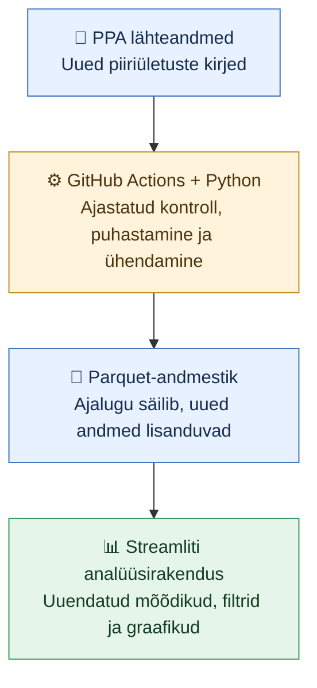

# Eesti piiriületuste analüüs

## Automaatne andmete uuendamine

```mermaid
flowchart TD
    A["📂 PPA lähteandmed<br/>Uued piiriületuste kirjed"]
    B["⚙️ GitHub Actions + Python<br/>Ajastatud kontroll, puhastamine ja ühendamine"]
    C["💾 Parquet-andmestik<br/>Ajalugu säilib, uued andmed lisanduvad"]
    D["📊 Streamliti analüüsirakendus<br/>Uuendatud mõõdikud, filtrid ja graafikud"]

    A --> B
    B --> C
    C --> D

    classDef data fill:#e8f1ff,stroke:#3973b9,color:#172b4d
    classDef process fill:#fff3dc,stroke:#c58b22,color:#4d3510
    classDef output fill:#e5f5e9,stroke:#39985a,color:#153d24

    class A,C data
    class B process
    class D output
```
